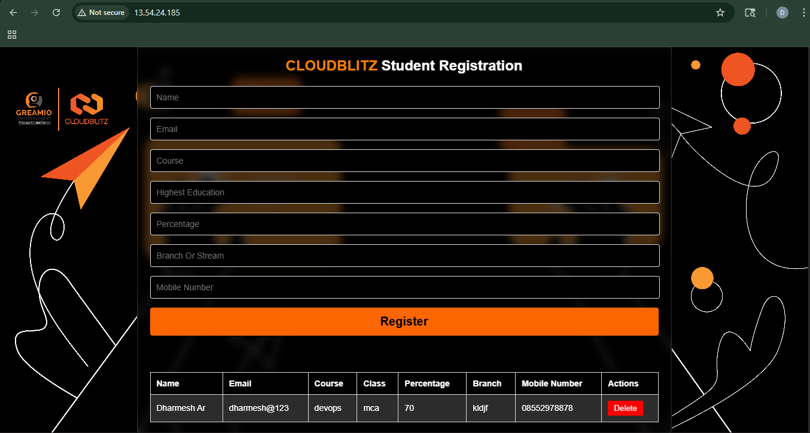

# 🚀 Full Stack Student Management System

A full-stack CRUD application to manage student records, built using modern technologies and deployed on cloud infrastructure.

---

## 🧑‍💻 Tech Stack

- 🌐 Frontend: React (Vite)  
- ⚙️ Backend: Spring Boot (REST API)  
- 🗄️ Database: MariaDB / AWS RDS  
- 🚀 Deployment: Apache / Docker / AWS  

---

## 📚 Project Documentation

📌 Click below to view detailed setup guides:

👉 🌐 Frontend → [Click to View](docs/frontend.md)  
👉 ⚙️ Backend → [Click to View](docs/backend.md)  
👉 🗄️ Database → [Click to View](docs/database.md)  

---

## 🖼️ Application Preview

<p align="center">
  
</p>

### ✨ Features

- Student Registration Form  
- Display Data in Table  
- Delete Functionality  
- Clean Dark UI Design  

---

## 🏗️ Architecture Overview

React Frontend (Vite)
        ↓
Spring Boot Backend (REST API)
        ↓
MariaDB / AWS RDS

---

## 📦 Prerequisites

- Node.js & npm  
- Java (JDK 17+)  
- Maven  
- MariaDB  
- Docker (optional)  

---

## 🚀 Quick Deployment Steps

### 1️⃣ Setup Database
- Install MariaDB  
- Create database & user  
- Create required tables  

### 2️⃣ Start Backend
```
cd backend  
mvn clean package  
java -jar target/spring-backend-v1.jar  
```
### 3️⃣ Setup Frontend
```
cd frontend  
npm install  
npm run build  
```
### 4️⃣ Deploy Frontend (Apache)
```
sudo apt install apache2 -y  
sudo systemctl start apache2  
sudo cp -rf dist/* /var/www/html/  
```
---

## 🌍 Application Access
```
- 🌐 Frontend → http://<SERVER_IP>  
- ⚙️ Backend → http://<SERVER_IP>:8080  
```
---

# 🐳 Docker Deployment (Full Stack)

## docker-compose.yml
```
version: "3.8"

services:

  db:
    image: mariadb:10.6
    container_name: mariadb_container
    restart: always
    environment:
      MYSQL_ROOT_PASSWORD: root123
      MYSQL_DATABASE: student_db
      MYSQL_USER: user
      MYSQL_PASSWORD: user123
    ports:
      - "3306:3306"
    volumes:
      - db_data:/var/lib/mysql

  backend:
    build: ./backend
    container_name: springboot_container
    depends_on:
      - db
    ports:
      - "8080:8080"
    environment:
      SPRING_DATASOURCE_URL: jdbc:mariadb://db:3306/student_db
      SPRING_DATASOURCE_USERNAME: user
      SPRING_DATASOURCE_PASSWORD: user123

  frontend:
    build: ./frontend
    container_name: react_container
    depends_on:
      - backend
    ports:
      - "80:80"

volumes:
  db_data:
```
---

## ▶️ Run Project
```
docker-compose up --build -d  
```
## 📊 Check Containers
```
docker ps  
```
## 🛑 Stop Project
```
docker-compose down  
```
---

## 🔐 Security Improvements

- Enable HTTPS using Nginx + SSL  
- Use environment variables for secrets  
- Restrict database access  
- Avoid hardcoding credentials  

---

## 🧠 Troubleshooting

| Issue | Solution |
|------|---------|
| Backend not starting | Check Java & Maven |
| DB connection error | Verify credentials |
| Frontend not loading | Check Apache/Docker |
| API not working | Verify `.env` |

---

## 🎯 Project Highlights

- Full-stack CRUD application  
- REST API architecture  
- Docker containerization  
- Cloud deployment ready  
- Scalable design  

---

## 🚀 Future Enhancements

- JWT Authentication  
- Dashboard  
- CI/CD  
- AWS Deployment  
- Kubernetes  

---

